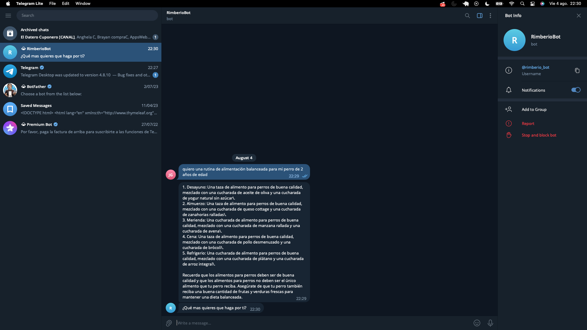
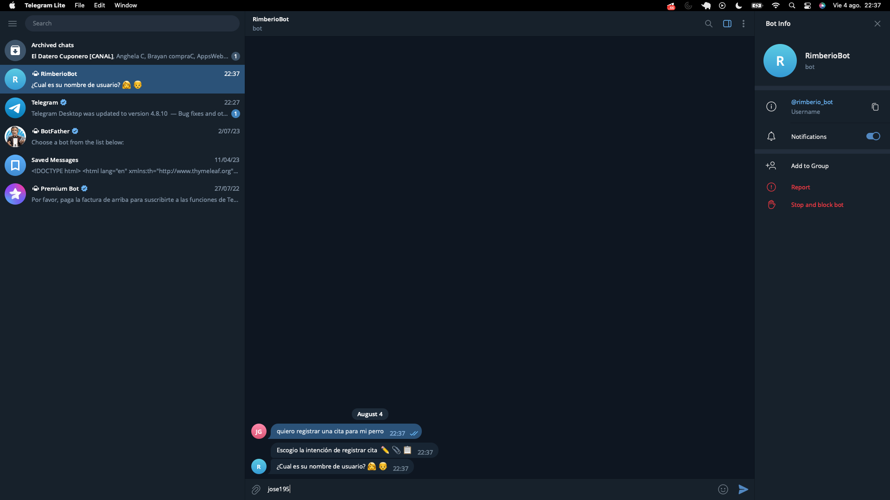

#Talk to Rimberio

Bot gestor de procesos tales como registro y lectura de citas para la veterinaria Rimberio, además posee integración con el modelo de inteligencia artificial conversacional GPT 3.

.
.

###*Tecnologías utilizadas*
- **Azure** ***uso de herramientas AI y hosting de la aplicación*
- **.Net Core 6.0**
- **GPT 3 - davinci**
- **Java** ***implementación Api Rest de los servicios de Rimberio*
- **AngularJS** ***implementación FrontEnd - Dashboard Rimberio*

 

**Equipo de Trabajo**
- [José Gutierrez](https://github.com/JosseG) *Coordinador*
- [Sebastián](https://github.com/Kalel-Hyu)
- [Anghela](https://github.com/angheSa)
- [Nicole](https://github.com/nicoci81194)
- [José Guerrero](https://github.com/JOSEproyecto2022)